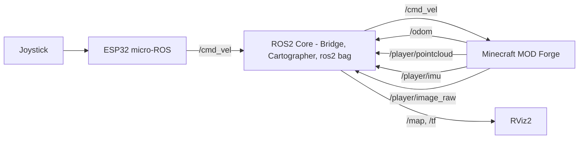

<p align="center">
  
</p>


# 🎮 Minecraft with ROS2 & SLAM

Minecraft를 ROS2 & microROS 환경에서 활용한 로봇 제어 및 SLAM 실습 및 실험 프로젝트입니다.

| 분류 | 사용 기술 |
|------|-----------|
| **Robotics & SLAM** | [](https://docs.ros.org/en/humble/index.html) [](https://google-cartographer-ros.readthedocs.io/)  |
| **Game & Development** | [](https://www.minecraft.net/)  [](https://gradle.org/) |
| **Embedded & Hardware** | [](https://www.espressif.com/en/products/socs/esp32)  |
| **Languages & Runtime** | [](https://openjdk.java.net/) [](https://www.python.org/) [](https://isocpp.org/) |
| **Environment & Tools** | [](https://ubuntu.com/) [](https://www.kernel.org/) [](https://www.docker.com/) [](https://cmake.org/) |
| **Visualization & GUI** | [](https://docs.ros.org/en/humble/Tutorials/Intermediate/RViz/RViz-User-Guide/RViz-User-Guide.html) |

---

## 1. 프로젝트 개요

<p align="center">
  
</p>

- **조이스틱 제어**: 물리적 조이스틱을 통한 Minecraft 캐릭터 원격 조종
- **micro-ROS 통신**: ESP32와 micro-ROS를 활용한 임베디드 시스템 연동
- **SLAM 맵핑**: Cartographer를 사용한 Minecraft 환경에서의 실시간 맵 생성

## 2. 시스템 구성



- 조이스틱: ESP32에서 입력 읽기, /cmd_vel 발행
- ESP32: micro-ROS 노드 실행, 조이스틱 → /cmd_vel로 ROS 2 전달
- PC: Minecraft 클라이언트 및 ROS2 노드(Cartographer, RViz2) 실행

| Topic Name           | Type                      | Source            | Purpose       |
| -------------------- | ------------------------- | ----------------- | ------------- |
| `/cmd_vel`           | `geometry_msgs/Twist`     | ESP32 (micro-ROS) | 캐릭터 제어 명령     |
| `/odom`              | `nav_msgs/Odometry`       | Minecraft MOD     | 위치·속도 추정      |
| `/player/pointcloud` | `sensor_msgs/PointCloud2` | Minecraft MOD     | LiDAR 포인트클라우드 |
| `/player/imu`        | `sensor_msgs/Imu`         | Minecraft MOD     | IMU 시뮬레이션 데이터 |
| `/player/image_raw`  | `sensor_msgs/Image`       | Minecraft MOD     | 카메라 이미지       |
| `/map`               | `nav_msgs/OccupancyGrid`  | Cartographer      | 2D 맵          |
| `/tf`                | `tf2_msgs/TFMessage`      | ROS 2 Core        | 좌표 변환         |

## 3. 개발 환경

>[!Note]
>버전 호환성을 갖춘 실험 환경 확보를 위해 ROS 2 Jazzy 호스트 위에서 Humble 컨테이너를 구동

- **Host OS**: Ubuntu 24.04
- **Container**: Docker 기반 Ubuntu 22.04 (ROS 2 Humble) 환경
- **Game Platform**: Minecraft Forge 1.20.1 + JDK 17
- **Embedded**: ESP32 + micro-ROS 펌웨어 환경

## 4. 주요 기능

### 📡 임베디드 연동
<p align="center">
  
</p>

- ESP32 기반 micro-ROS 노드와의 실시간 통신
- 조이스틱 입력을 ROS2 /cmd_vel 토픽으로 전달

### 🎮 조이스틱 제어
<p align="center">
  
</p>

- ROS2 `/cmd_vel` 메시지를 통한 실시간 캐릭터 제어

### 🗺️ SLAM 맵핑
<p align="center">
  
</p>

- Cartographer를 사용한 Minecraft 맵의 실시간 2D 맵 생성
- 3D LiDAR 센서 시뮬레이션을 통한 환경 인식

>[!Note]
> Minecraft로부터 3D point cloud를 수신하는 과정의 지연(latency) 때문에 빠른 각속도 회전 시 맵 생성 품질이 저하됨을 확인했습니다.<br>
> 본 프로젝트에서는 공개된 오픈소스 LiDAR 시뮬레이션 아이템을 사용했기 때문에 전진/후진 중심 주행으로 맵을 생성했습니다. 

## 5. 파일 구조

```
├── src/                    # Minecraft MOD 소스코드
│   ├── main/               # 메인 소스코드
│   └── minecraft_odometry/ # 추가된 ROS 2 패키지
├── scripts/                # 실행 스크립트
├── config/                 # 설정 파일
│   └── minecraft.rviz      # RViz2 설정 파일
├── docs/                   # 프로젝트 문서
└── run/                    # Minecraft 실행 환경
```

## 6. 참고사항

이 프로젝트는 실험 및 실습 목적으로 제작되었습니다.

## 7. 라이센스

이 프로젝트는 [Apache License 2.0](LICENSE.txt) 하에 배포됩니다.

---

*본 프로젝트는 [minecraft-ros2](https://github.com/minecraft-ros2/minecraft_ros2) 프로젝트의 코드를 기반으로 실험을 진행했습니다.*
